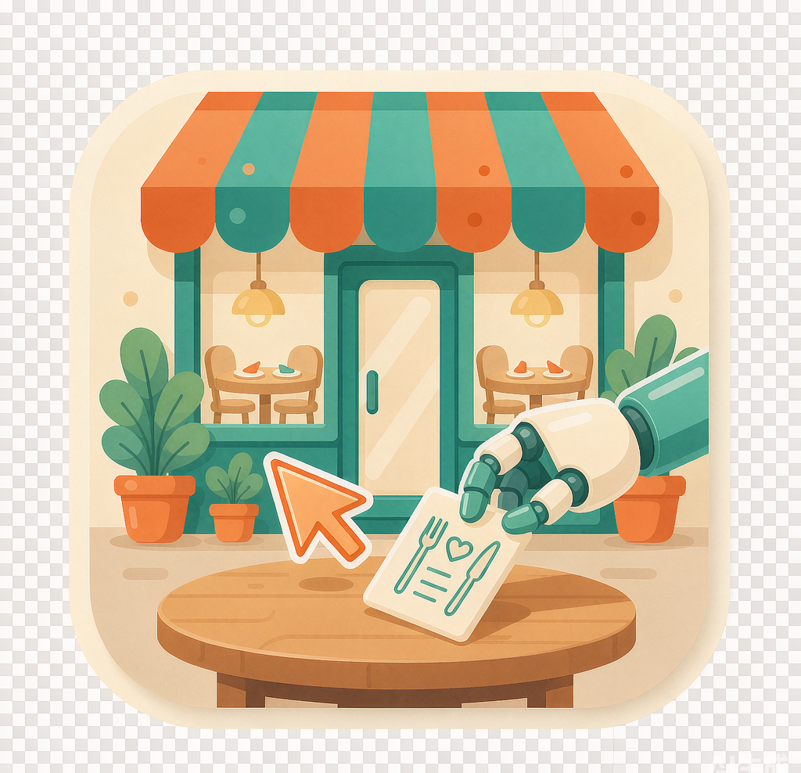

<div align="center">



# 店铺助理 ShopAssistant

餐厅经营小游戏的挂机助手 —— 自动接待顾客、收金币、轮换房间、自动开局下一局。

</div>

---

一个悬浮窗小助手：按 **F8** 开始后自动识别游戏画面，把顾客拖到与其偏好匹配的空桌上入座，
定时收集场内金币，房间满员自动切换；一局结束检测到「结束营业」后自动重启进入下一局，
全程无需人工干预。按 **F9** 随时停止。

## 功能一览

| 功能 | 说明 |
|------|------|
| 悬浮控制窗 | 置顶小窗：开始/结束按钮、选项、实时日志框（长文本自动换行） |
| 自动入座 | 拖出顾客 → 读取偏好与桌台标签 → 标签匹配入座（≤0.5s/位）；绿光作补充信号 |
| 收集金币 | 周期性点「一键收集」并逐个点场内剩余金币堆 |
| 房间轮换 | 银→金→铜顺序，优先切到门牌数字显示有空位的房间；满员快切 |
| 满桌拉黑 | 入座结果核验，同一桌 30s 内连续 2 次失败即临时拉黑，不再反复拖 |
| 任意匹配模式 | 可选：跳过标签匹配，有空位就放（速度更快） |
| 全局快捷键 | F8 开始 / F9 结束（游戏全屏时也有效） |
| 自动重启营业 | 检测「结束营业」→ 结算页 → 首页「开始营业」→ 开业准备页「开始营业」→ 下一局 |
| 事件弹窗处理 | 随机事件弹窗（2~3 个选项）自动随机选一个并等待消失 |
| 安全细节 | 多重停止手段 + 动作层防御，详见下文「避险与防御机制」 |

## 快速开始（源码运行）

需要 **Python 3.10+（带 tkinter）**，Windows 系统：

```bash
pip install -r requirements.txt
python main.py
```

1. 打开游戏窗口，保持前台可见；
2. 点「框选游戏区域」，拖拽框住整个游戏画面（配置保存在 `config.json`，首次会自动生成）；
3. **把悬浮控制窗拖到游戏画面之外**（如屏幕边缘/副屏）——程序靠截屏识别，运行期间任何
   覆盖在游戏画面上的窗口都会干扰识别；
4. 点「▶ 开始 (F8)」，日志框会实时显示每一步动作；
5. 「■ 结束 (F9)」停止；紧急情况把鼠标甩到屏幕左上角。

## 避险与防御机制

> **声明：本项目仅供学习研究使用**，仅用于学习屏幕视觉识别（OpenCV 模板匹配 / HSV 颜色
> 识别）、桌面自动化（pyautogui）与 Python GUI 编程等技术课题，以一款单机经营小游戏
> 作为练习对象。本项目不用于任何商业用途、不破坏游戏平衡性对抗、不采集或上传任何数据
> （所有识别均在本地完成，配置与截图只保存在本机），也没有其他任何意图。若游戏官方
> 对自动化操作有相关规则约束，请自行遵守并承担使用风险；请合理安排游戏时间。

程序在设计上做了多层保护，尽量保证失控时可随时叫停、误操作不造成连锁影响：

**随时可停（多重停止手段）**

| 手段 | 触发方式 | 生效范围 |
|---|---|---|
| 结束按钮 / F9 热键 | 点「■ 结束」或按 F9 | 正常停止，游戏全屏无焦点时也有效 |
| 紧急中止（FAILSAFE） | 把鼠标猛甩到**屏幕左上角** | pyautogui 立即抛错中止当前动作，之后每次鼠标操作都会继续抛错，等效"停手"；再按 F8 可重新开始 |
| 重启链超时自停 | 自动重启营业流程 45s 内未走完 | 自动停止并写日志，不会无限点击 |
| 结账画面检测 | 检测到「结束营业」按钮 | 按开关走自动重启或自动停止 |

**动作层防御**

- 鼠标所有落点带 **±8px 随机偏移**（中心密集分布），模拟真人操作，避免每次点击位置完全一致；
- **单次循环异常隔离**：任何一轮识别/操作出错只记日志、停 1.5s 后继续下一轮，单帧失败不会崩溃；
- **入座结果核验**：拖放后下一轮复核顾客是否真的坐进桌子，失败不会反复重试同一桌；
- **满桌 30s 拉黑**：同一桌连续 2 次入座失败即临时拉黑，30s 后自动解封（桌位可能空出来）；
- 顾客未匹配到桌子时会**原样放回顾客区**，不乱丢；
- 开始/结束**幂等**：重复按 F8/F9 或连点按钮无副作用。

## 打包为单体 exe

```bash
build_exe.bat
# 或手动：
pip install pyinstaller
pyinstaller shop_assistant.spec --noconfirm
```

产物：`dist/ShopAssistant.exe`（单文件、无控制台、内嵌模板与 logo 图标）。
`config.json` 会在 exe 同目录自动生成；`templates/`、`assets/` 已打包进 exe，无需随行。

## 项目结构

```
├── main.py               # 主程序：悬浮窗 GUI + 自动化工作循环 + 热键 + 重启链
├── vision.py             # 屏幕捕获与识别（空桌/顾客/标签/绿光/按钮/房间门/门牌数字/弹窗）
├── actions.py            # 鼠标模拟（平滑拖拽、随机偏移点击）
├── requirements.txt
├── shop_assistant.spec   # PyInstaller 打包配置
├── build_exe.bat         # 一键打包脚本
├── config.example.json   # 配置示例（config.json 为本机运行时生成，不入库）
├── templates/            # 识别模板图片（52 张，与代码配套）
├── assets/               # logo.png / logo.ico
├── docs/                 # 需求与设计说明（算法阈值、踩坑记录、验收标准）
├── tools/                # 辅助工具
│   ├── calibrate.py          # 全屏遮罩拖拽框选游戏区域（独立小工具）
│   ├── capture_template.py   # 框选截取识别模板（补充/修正 templates/）
│   └── harvest_digits.py     # 从截图中提取门牌数字字形模板
└── tests/                # 诊断与测试脚本
    ├── selftest.py           # 离线自检（用参考截图验证识别）
    ├── test_drag.py          # 拖拽状态诊断（无损）
    └── test_seat_once.py     # 单次真实入座测试
```

## 识别与工作原理（简述）

- **游戏机制**：顾客卡只有在被按住拖出顾客区时，游戏才显示各桌「+」、桌下店员标签条与
  顾客偏好图标——程序完全按此流程模拟真人操作；
- **匹配策略**：桌下标签条（每局固定）∩ 顾客偏好图标 为主，官方绿光信号为辅；
- **门牌数字**：左上角房间门下「已入座/容量」由字形模板匹配读出，用于择房与满员快切；
- **速度优化**：房间「+」样式锁定 + 桌位缓存局部验证（稳态 ~10ms）+ mss 实例复用 +
  半分辨率粗筛，单顾客入座全链路 ≤ 0.5s。

详细算法阈值、踩坑记录与验收标准见仓库外层交付包中的
《需求与设计说明.md》（含离线回归样本截图）。

## 辅助工具

| 命令 | 用途 |
|---|---|
| `python tests/selftest.py` | 用参考截图离线自检识别是否正常 |
| `python tests/test_drag.py` | 拖拽状态诊断（读偏好/标签/绿光，不真正入座） |
| `python tests/test_seat_once.py` | 单次真实入座（联调用） |
| `python tools/calibrate.py` | 独立运行区域框选 |
| `python tools/capture_template.py <名字>` | 框选截取新模板存入 templates/ |
| `python tools/harvest_digits.py` | 从样本截图补提数字字形（当前缺 3/4/7/9） |

## 注意（使用方法要点）

- **程序运行期间不能遮挡游戏画面**：程序靠定时截屏识别画面，任何盖在框选区域上的窗口
  （包括本程序自己的悬浮窗、聊天弹窗、视频画中画等）都会被一起截进去导致识别失败。
  请把悬浮控制窗拖到游戏画面之外放置；
- **运行中不要移动鼠标、不要敲键盘**：程序按坐标模拟真人拖拽，人为抢鼠标会打断当前动作；
  需要接管时按 F9 或甩鼠标到左上角先停掉；
- 框选区域要**恰好框住游戏画面**：框大了会把游戏外的内容截进来（误识别风险），
  框小了会漏掉房间/按钮；窗口位置移动、分辨率/缩放变化后需重新框选；
- 游戏窗口需保持前台可见，被最小化或切到后台后程序无法识别；
- Windows 显示缩放建议 100%（程序已做 DPI 感知，其他缩放比例如坐标漂移请重框区域）；
- 本项目仅供学习交流，请合理安排游戏时间。
